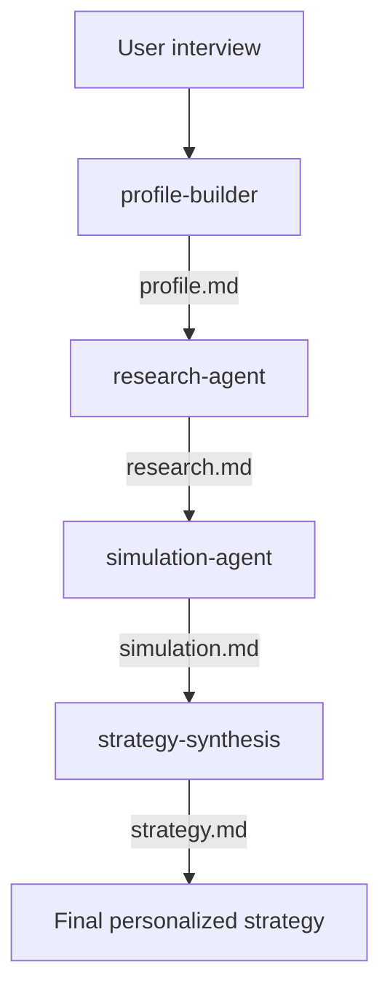
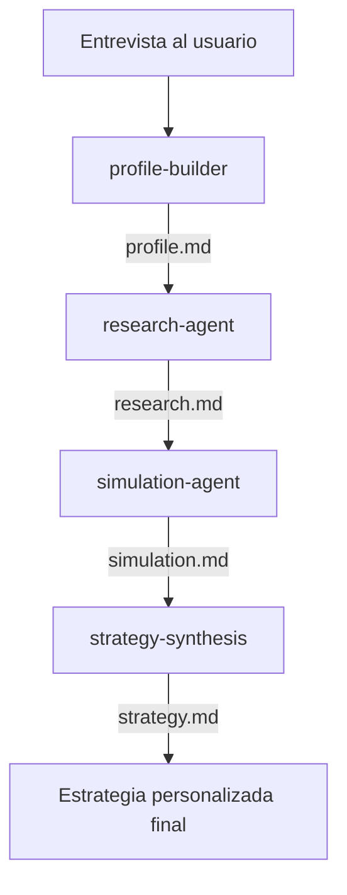

# Multi-agent investment strategy setup ([Versión en español](#versión-en-español) )
A multiagent AI system, built with [Claude Code](https://code.claude.com), that interviews you, researches real investment options, runs actual numeric projections, and synthesizes a personalized household investment strategy - end to end, with no step left to a single generalist prompt.
Built as a learning project in agentic multi-agent architecture, and as a working tool for a real household's own strategy.

> **This is not financial or tax advice.** Every output is educational scenario modeling, built from your own self-reported numbers, and should be reviewed by a qualified professional before you act on any of it.

---

## Table of contents

- [Why this exists](#why-this-exists)
- [Architecture](#architecture)
- [Repository structure](#repository-structure)
- [How the pipeline works](#how-the-pipeline-works)
- [Setup](#setup)
- [Usage](#usage)
- [Design principles](#design-principles)
- [Known limitations](#known-limitations)
- [License](#license)

---

## Why this exists

Three goals, explicitly, from the start:

1. **A real, working strategy** for one actual household, using its actual numbers.
2. **A genuine, hands-on demonstration of multi-agent architecture** - an orchestrator coordinating scoped specialist subagents with real tool permissions, not a single chatbot pretending to have personas.
3. **A guide other first-time investors can follow** to build their own version - the architecture and method are the product here, not investment picks.

What this project deliberately does **not** do: give personalized investment advice to anyone other than the person running it on their own data. That's a regulated activity in most jurisdictions. This system teaches the method; it doesn't dispense the advice.

## Architecture

One orchestrator, four scoped subagents, each with only the tools its job requires.



| Agent | Reads | Writes | Tools | Job |
|---|---|---|---|---|
| `profile-builder` | - | `profile.md` | Read, Write | Interviews the user; builds a structured financial and goals profile |
| `research-agent` | `profile.md` | `research.md` | Read, WebSearch, WebFetch, Write | Finds real, currently available, legally-eligible investment vehicles |
| `simulation-agent` | `profile.md`, `research.md` | `simulation.md` | Read, Bash, Write | Runs actual scripted projections - no freehand arithmetic |
| `strategy-synthesis` | all three above | `strategy.md` | Read, Write | Picks the best-fit path per goal, self-checks it, writes the final strategy |

`CLAUDE.md` is the orchestrator - not a fifth agent, but the instruction set the main Claude Code session follows to sequence the four subagents and hand context between them.

## Repository structure

```
household-investment-ai/
├── CLAUDE.md                      # Orchestrator: pipeline logic, hard constraints
├── .claude/
│   └── agents/
│       ├── profile-builder.md
│       ├── research-agent.md
│       ├── simulation-agent.md
│       └── strategy-synthesis.md
└── profiles/
    └── <profile-name>/            # One folder per household/test persona
        ├── profile.md
        ├── research.md
        ├── simulation.md
        ├── simulate.py            # The actual projection script
        └── strategy.md
```

Every run belongs to a named profile under `profiles/`, so a real household and any number of test personas can exist side by side without overwriting each other.

## How the pipeline works

1. **profile-builder** interviews conversationally, one topic at a time - household composition, income per earner, experience level, goals (with explained short/mid/long-term timeframes and guided retirement-budget building if none exists), financial position, risk tolerance *and* capacity asked separately, constraints. Saves progress incrementally, so an interrupted session resumes exactly where it left off rather than restarting.
2. **research-agent** reads the completed profile and searches for real, currently available vehicles - index funds, UCITS ETFs, robo-advisors, pension products, employer-matched plans where applicable - filtered for actual legal availability, screened against values constraints, curated to a handful of genuinely distinct options rather than an overwhelming list.
3. **simulation-agent** builds 2–3 candidate allocations per goal from what research actually found, and computes projections by writing and running a real Python script - never by reasoning about numbers in text. Applies fees, taxes, and a stress-case downside scenario; converts a stated retirement budget into a target savings number using a stated withdrawal-rate assumption.
4. **strategy-synthesis** reads everything, checks debt and emergency-fund status *before* recommending any allocation, verifies the total plan actually fits the household's real savings capacity, picks a best-fit path per goal with a visible alternative, and runs a mandatory self-check against risk capacity, liquidity, concentration, and realism before finalizing.

## Setup

- [Claude Code](https://code.claude.com) installed
- A Claude Pro, Max, or Team plan (Sonnet 5 handles this pipeline well - Opus isn't required)
- macOS/Linux terminal (or Claude Code's supported Windows setup)

```bash
git clone <this-repo-url>
cd household-investment-ai
claude
```

## Usage

Inside Claude Code, at the `>` prompt:

```
Run the investment strategy pipeline for the profile "your-name".
```

To test a different persona without touching your real data:

```
Run the investment strategy pipeline for a new test profile called "first-job-25yo".
```

Check where any profile stands at any time by opening its `profile.md` and reading the `Status` line at the top (`in progress` or `complete`).

## Design principles

- **Real calculation, not LLM arithmetic.** Every number in `simulation.md` comes from an executed script, cross-checked against a second, independent computation before being written.
- **Explicit anti-goals.** Agents are instructed *not* to optimize for the most impressive number - a stated safeguard against the subtle bias toward recommending whatever looks best on paper.
- **Cross-file consistency, checked deliberately.** Tax-jurisdiction assumptions, household schema, and data handoffs between agents were each independently verified to make sure a downstream agent never silently outgrows or misreads what an upstream agent actually produces.
- **Scoped tools per agent.** Each subagent has exactly the tool access its job requires and nothing more - `profile-builder` can't search the web, `research-agent` can't execute code.
- **Legal and regulatory framing built into the instructions**, not bolted on as a disclaimer - the "not financial advice" boundary, jurisdiction checks, and legally-eligible-vehicle filtering all live inside the agents themselves.

## Known limitations

- Assumes one shared tax jurisdiction per household; a household with earners taxed in different countries needs to note this explicitly, and the output should be treated as more provisional.
- Wealth tax and interim ETF-rebalancing tax are not modeled.
- Currency risk is shown as a sensitivity range, not a directional prediction.
- Historical return ranges inform projections but are explicitly not a guarantee of future performance.

## License

Not yet chosen - add one here before treating this as reusable by others (MIT is a common default for a project like this).

# Versión en español

# Configuración multiagente para estrategia de inversión 
Un sistema de IA multiagente, construido con [Claude Code](https://code.claude.com), que te entrevista, investiga opciones de inversión reales, ejecuta proyecciones numéricas de verdad y sintetiza una estrategia de inversión personalizada para tu hogar, de principio a fin, sin dejar ningún paso en manos de un único prompt generalista.
Creado como proyecto de aprendizaje en arquitectura agéntica multiagente, y como herramienta funcional para la estrategia real de un hogar concreto.

> **Esto no es asesoramiento financiero ni fiscal.** Todos los resultados son modelos de escenarios con fines educativos, construidos a partir de tus propios datos autodeclarados, y deben ser revisados por un profesional cualificado antes de actuar en base a ellos.

---

## Índice

- [Por qué existe](#por-qué-existe)
- [Arquitectura](#arquitectura)
- [Estructura del repositorio](#estructura-del-repositorio)
- [Cómo funciona el pipeline](#cómo-funciona-el-pipeline)
- [Instalación](#instalación)
- [Uso](#uso)
- [Principios de diseño](#principios-de-diseño)
- [Limitaciones conocidas](#limitaciones-conocidas)
- [Licencia](#licencia)

---

## Por qué existe

Tres objetivos, explícitos desde el principio:

1. **Una estrategia real y funcional** para un hogar concreto, con sus cifras reales.
2. **Una demostración práctica y genuina de arquitectura multiagente**: un orquestador que coordina subagentes especializados, con un alcance acotado y permisos reales sobre herramientas, no un único chatbot que finge tener personalidades distintas.
3. **Una guía que otros inversores primerizos puedan seguir** para construir su propia versión: aquí el producto es la arquitectura y el método, no las recomendaciones de inversión.

Lo que este proyecto deliberadamente **no** hace: dar asesoramiento de inversión personalizado a nadie que no sea la persona que lo ejecuta con sus propios datos. En la mayoría de jurisdicciones esa es una actividad regulada. Este sistema enseña el método; no dispensa el asesoramiento.

## Arquitectura

Un orquestador y cuatro subagentes con alcance acotado, cada uno con solo las herramientas que su tarea requiere.



| Agente | Lee | Escribe | Herramientas | Función |
|---|---|---|---|---|
| `profile-builder` | - | `profile.md` | Read, Write | Entrevista al usuario; construye un perfil estructurado de su situación financiera y sus objetivos |
| `research-agent` | `profile.md` | `research.md` | Read, WebSearch, WebFetch, Write | Busca vehículos de inversión reales, disponibles actualmente y legalmente accesibles |
| `simulation-agent` | `profile.md`, `research.md` | `simulation.md` | Read, Bash, Write | Ejecuta proyecciones reales mediante scripts, sin aritmética a mano alzada |
| `strategy-synthesis` | los tres anteriores | `strategy.md` | Read, Write | Elige la opción más adecuada para cada objetivo, la autoverifica y redacta la estrategia final |

`CLAUDE.md` es el orquestador: no es un quinto agente, sino el conjunto de instrucciones que sigue la sesión principal de Claude Code para secuenciar los cuatro subagentes y pasarles el contexto entre ellos.

## Estructura del repositorio

```
household-investment-ai/
├── CLAUDE.md                      # Orquestador: lógica del pipeline, restricciones obligatorias
├── .claude/
│   └── agents/
│       ├── profile-builder.md
│       ├── research-agent.md
│       ├── simulation-agent.md
│       └── strategy-synthesis.md
└── profiles/
    └── <nombre-del-perfil>/       # Una carpeta por hogar/perfil de prueba
        ├── profile.md
        ├── research.md
        ├── simulation.md
        ├── simulate.py            # El script de proyección propiamente dicho
        └── strategy.md
```

Cada ejecución pertenece a un perfil con nombre dentro de `profiles/`, de modo que un hogar real y cualquier número de perfiles de prueba pueden coexistir sin sobrescribirse entre sí.

## Cómo funciona el pipeline

1. **profile-builder** realiza una entrevista conversacional, un tema a la vez: composición del hogar, ingresos de cada perceptor, nivel de experiencia, objetivos (con plazos de corto, medio y largo plazo explicados, y ayuda guiada para construir un presupuesto de jubilación si no existe), situación financiera, tolerancia al riesgo *y* capacidad de asumirlo (preguntadas por separado), y restricciones. Guarda el progreso de forma incremental, así que una sesión interrumpida se retoma exactamente donde se dejó, en lugar de empezar de cero.
2. **research-agent** lee el perfil completo y busca vehículos reales y disponibles actualmente (fondos indexados, ETF UCITS, roboadvisors, productos de pensiones, planes con aportación del empleador cuando corresponda), filtrados por disponibilidad legal real, cribados según las restricciones de valores del usuario y seleccionados hasta dejar un puñado de opciones realmente distintas, en lugar de una lista abrumadora.
3. **simulation-agent** construye 2 o 3 asignaciones candidatas por objetivo a partir de lo que la investigación encontró realmente, y calcula las proyecciones escribiendo y ejecutando un script de Python real, nunca razonando sobre números en texto. Aplica comisiones, impuestos y un escenario de estrés a la baja; convierte un presupuesto de jubilación declarado en una cifra objetivo de ahorro usando una hipótesis explícita de tasa de retirada.
4. **strategy-synthesis** lo lee todo, comprueba la situación de deudas y del fondo de emergencia *antes* de recomendar cualquier asignación, verifica que el plan total encaje realmente con la capacidad de ahorro real del hogar, elige la opción más adecuada para cada objetivo con una alternativa visible, y realiza una autoverificación obligatoria de capacidad de riesgo, liquidez, concentración y realismo antes de darlo por cerrado.

## Instalación

- [Claude Code](https://code.claude.com) instalado
- Un plan Claude Pro, Max o Team (Sonnet 5 gestiona bien este pipeline; no hace falta Opus)
- Terminal de macOS/Linux (o la configuración de Windows compatible con Claude Code)

```bash
git clone <url-de-este-repo>
cd household-investment-ai
claude
```

## Uso

Dentro de Claude Code, en el prompt `>`:

```
Ejecuta el pipeline de estrategia de inversión para el perfil "tu-nombre".
```

Para probar otro perfil sin tocar tus datos reales:

```
Ejecuta el pipeline de estrategia de inversión para un nuevo perfil de prueba llamado "primer-empleo-25anos".
```

Puedes comprobar en qué punto está cualquier perfil en todo momento abriendo su `profile.md` y leyendo la línea `Status` al principio (`in progress` o `complete`).

## Principios de diseño

- **Cálculo real, no aritmética de LLM.** Cada cifra de `simulation.md` sale de un script ejecutado y se contrasta con un segundo cálculo independiente antes de escribirse.
- **Antiobjetivos explícitos.** Los agentes tienen instrucciones de *no* optimizar para obtener la cifra más impresionante: una salvaguarda explícita contra el sesgo sutil de recomendar lo que mejor queda sobre el papel.
- **Coherencia entre archivos, verificada deliberadamente.** Las hipótesis de jurisdicción fiscal, el esquema del hogar y los traspasos de datos entre agentes se verificaron de forma independiente para garantizar que un agente posterior nunca exceda en silencio ni malinterprete lo que produce realmente un agente anterior.
- **Herramientas acotadas por agente.** Cada subagente tiene exactamente el acceso a herramientas que requiere su tarea y nada más: `profile-builder` no puede buscar en la web y `research-agent` no puede ejecutar código.
- **Marco legal y regulatorio integrado en las instrucciones**, no añadido después como un simple descargo de responsabilidad: el límite de "esto no es asesoramiento financiero", las comprobaciones de jurisdicción y el filtrado de vehículos legalmente accesibles viven dentro de los propios agentes.

## Limitaciones conocidas

- Asume una única jurisdicción fiscal compartida por hogar; un hogar con perceptores que tributan en países distintos debe indicarlo explícitamente, y el resultado debe considerarse más provisional.
- No se modelan el impuesto sobre el patrimonio ni la tributación intermedia por rebalanceo de ETF.
- El riesgo de divisa se muestra como un rango de sensibilidad, no como una predicción direccional.
- Los rangos de rentabilidad histórica sirven de base para las proyecciones, pero explícitamente no garantizan rentabilidades futuras.

## Licencia

Aún no elegida: añade una aquí antes de considerar este proyecto reutilizable por otras personas (MIT es una opción habitual por defecto para un proyecto como este).
