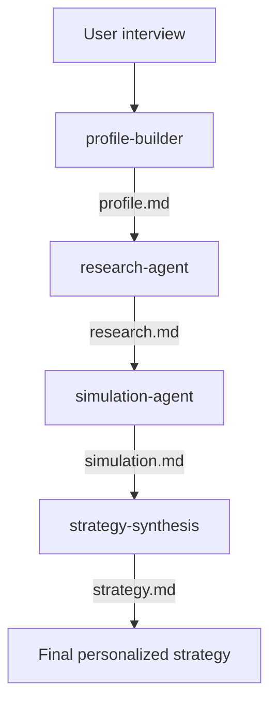

# Multi-agent investment strategy setup
A multiagent AI system, built with [Claude Code](https://code.claude.com), that interviews you, researches real investment options, runs actual numeric projections, and synthesizes a personalized household investment strategy - end to end, with no step left to a single generalist prompt.
Built as a learning project in agentic multi-agent architecture, and as a working tool for a real household's own strategy.

> **This is not financial or tax advice.** Every output is educational scenario modeling, built from your own self-reported numbers, and should be reviewed by a qualified professional before you act on any of it.

---

## Table of contents

- [Why this exists](#why-this-exists)
- [Architecture](#architecture)
- [Repository structure](#repository-structure)
- [How the pipeline works](#how-the-pipeline-works)
- [Setup](#setup)
- [Usage](#usage)
- [Design principles](#design-principles)
- [Known limitations](#known-limitations)
- [License](#license)

---

## Why this exists

Three goals, explicitly, from the start:

1. **A real, working strategy** for one actual household, using its actual numbers.
2. **A genuine, hands-on demonstration of multi-agent architecture** - an orchestrator coordinating scoped specialist subagents with real tool permissions, not a single chatbot pretending to have personas.
3. **A guide other first-time investors can follow** to build their own version - the architecture and method are the product here, not investment picks.

What this project deliberately does **not** do: give personalized investment advice to anyone other than the person running it on their own data. That's a regulated activity in most jurisdictions. This system teaches the method; it doesn't dispense the advice.

## Architecture

One orchestrator, four scoped subagents, each with only the tools its job requires.



| Agent | Reads | Writes | Tools | Job |
|---|---|---|---|---|
| `profile-builder` | - | `profile.md` | Read, Write | Interviews the user; builds a structured financial and goals profile |
| `research-agent` | `profile.md` | `research.md` | Read, WebSearch, WebFetch, Write | Finds real, currently available, legally-eligible investment vehicles |
| `simulation-agent` | `profile.md`, `research.md` | `simulation.md` | Read, Bash, Write | Runs actual scripted projections - no freehand arithmetic |
| `strategy-synthesis` | all three above | `strategy.md` | Read, Write | Picks the best-fit path per goal, self-checks it, writes the final strategy |

`CLAUDE.md` is the orchestrator - not a fifth agent, but the instruction set the main Claude Code session follows to sequence the four subagents and hand context between them.

## Repository structure

```
household-investment-ai/
├── CLAUDE.md                      # Orchestrator: pipeline logic, hard constraints
├── .claude/
│   └── agents/
│       ├── profile-builder.md
│       ├── research-agent.md
│       ├── simulation-agent.md
│       └── strategy-synthesis.md
└── profiles/
    └── <profile-name>/            # One folder per household/test persona
        ├── profile.md
        ├── research.md
        ├── simulation.md
        ├── simulate.py            # The actual projection script
        └── strategy.md
```

Every run belongs to a named profile under `profiles/`, so a real household and any number of test personas can exist side by side without overwriting each other.

## How the pipeline works

1. **profile-builder** interviews conversationally, one topic at a time - household composition, income per earner, experience level, goals (with explained short/mid/long-term timeframes and guided retirement-budget building if none exists), financial position, risk tolerance *and* capacity asked separately, constraints. Saves progress incrementally, so an interrupted session resumes exactly where it left off rather than restarting.
2. **research-agent** reads the completed profile and searches for real, currently available vehicles - index funds, UCITS ETFs, robo-advisors, pension products, employer-matched plans where applicable - filtered for actual legal availability, screened against values constraints, curated to a handful of genuinely distinct options rather than an overwhelming list.
3. **simulation-agent** builds 2–3 candidate allocations per goal from what research actually found, and computes projections by writing and running a real Python script - never by reasoning about numbers in text. Applies fees, taxes, and a stress-case downside scenario; converts a stated retirement budget into a target savings number using a stated withdrawal-rate assumption.
4. **strategy-synthesis** reads everything, checks debt and emergency-fund status *before* recommending any allocation, verifies the total plan actually fits the household's real savings capacity, picks a best-fit path per goal with a visible alternative, and runs a mandatory self-check against risk capacity, liquidity, concentration, and realism before finalizing.

## Setup

- [Claude Code](https://code.claude.com) installed
- A Claude Pro, Max, or Team plan (Sonnet 5 handles this pipeline well - Opus isn't required)
- macOS/Linux terminal (or Claude Code's supported Windows setup)

```bash
git clone <this-repo-url>
cd household-investment-ai
claude
```

## Usage

Inside Claude Code, at the `>` prompt:

```
Run the investment strategy pipeline for the profile "your-name".
```

To test a different persona without touching your real data:

```
Run the investment strategy pipeline for a new test profile called "first-job-25yo".
```

Check where any profile stands at any time by opening its `profile.md` and reading the `Status` line at the top (`in progress` or `complete`).

## Design principles

- **Real calculation, not LLM arithmetic.** Every number in `simulation.md` comes from an executed script, cross-checked against a second, independent computation before being written.
- **Explicit anti-goals.** Agents are instructed *not* to optimize for the most impressive number - a stated safeguard against the subtle bias toward recommending whatever looks best on paper.
- **Cross-file consistency, checked deliberately.** Tax-jurisdiction assumptions, household schema, and data handoffs between agents were each independently verified to make sure a downstream agent never silently outgrows or misreads what an upstream agent actually produces.
- **Scoped tools per agent.** Each subagent has exactly the tool access its job requires and nothing more - `profile-builder` can't search the web, `research-agent` can't execute code.
- **Legal and regulatory framing built into the instructions**, not bolted on as a disclaimer - the "not financial advice" boundary, jurisdiction checks, and legally-eligible-vehicle filtering all live inside the agents themselves.

## Known limitations

- Assumes one shared tax jurisdiction per household; a household with earners taxed in different countries needs to note this explicitly, and the output should be treated as more provisional.
- Wealth tax and interim ETF-rebalancing tax are not modeled.
- Currency risk is shown as a sensitivity range, not a directional prediction.
- Historical return ranges inform projections but are explicitly not a guarantee of future performance.

## License

Not yet chosen - add one here before treating this as reusable by others (MIT is a common default for a project like this).
